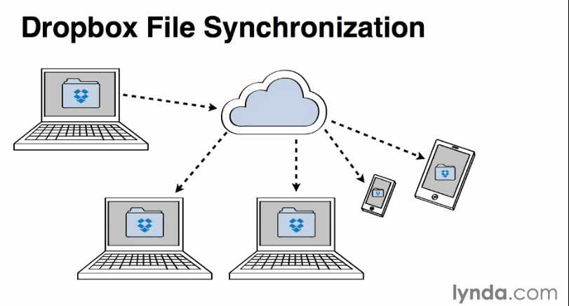

##Dropbox Basics
Dropbox is a cloud storage which gives the user the ability to synchronize files
across devices. No matter where you are and what devices is available for you
you can access your files with the help of an internet connection.
###Across Devices and Locations
___

Dropbox files can be accessed by many different devices with a browser on it.
###Other Cloud Storage Providers are:
___
+ Google Drive
+ Microsoft Onedrive
+ SugarSync
+ Box
###Dropbox Features
Dropbox has version control
large files
collaboration through sharing folders
foto sharing
backup
###Personal storage
free account: 
###Dropbox Security
where are  my files (on amazon services)
login 	(use 2step verification enable in profile settings mobile phone nbr)
256 ssl
backup (redundant backup, install in special folder:users/hans/dropbox)
drag and drop to user dropbox folder
###Versiioning
___
show previous versions (15 previous versions)
restore (replace version 2 with version 1 or get a copy and download it)
###Offline Acces
___
select a file as favorite and you will have if offline too.
###Dropbox App
___
###Camera Upload
___

